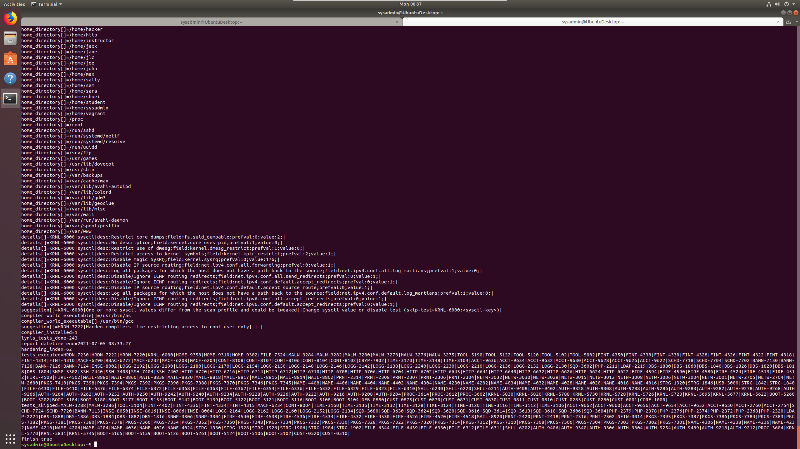
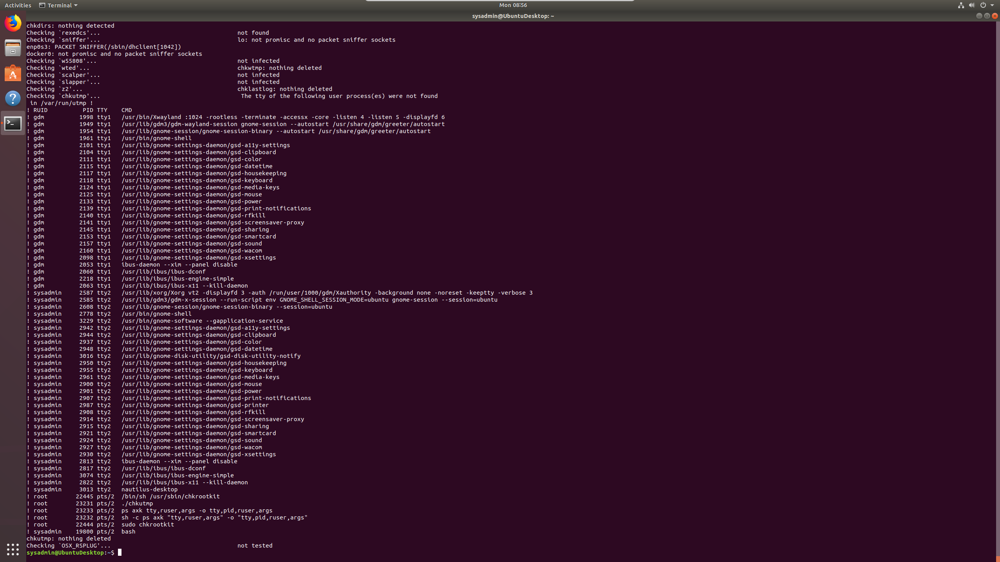
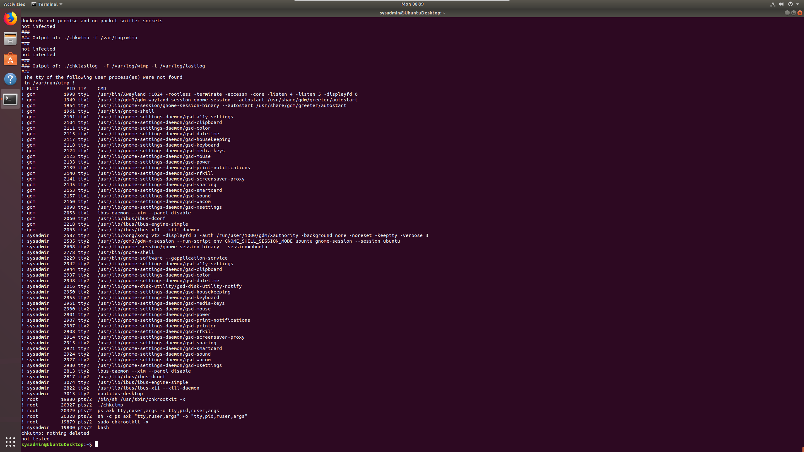

## Week 4 Homework Submission File: Linux Systems Administration

### Step 1: Ensure/Double Check Permissions on Sensitive Files

1. Permissions on `/etc/shadow` should allow only `root` read and write access.
    - Command to inspect permissions:
        - `ls -l /etc/shadowls -l /etc/shadow`
    - Command to set permissions (if needed):
        - `sudo chmod 600 /etc/shadow`

2. Permissions on `/etc/gshadow` should allow only `root` read and write access.
    - Command to inspect permissions:
        - `ls -l /etc/gshadow`
    - Command to set permissions (if needed):
        - `sudo chmod 600 /etc/gshadow`

3. Permissions on `/etc/group` should allow `root` read and write access, and allow everyone else read access only.
    - Command to inspect permissions:
        - `ls -l /etc/group`
    - Command to set permissions (if needed):
        - `sudo chmod 644 /etc/group`

4. Permissions on `/etc/passwd` should allow `root` read and write access, and allow everyone else read access only.
    - Command to inspect permissions:
        - `ls -l /etc/passwd`
    - Command to set permissions (if needed):
        - Permission already 644 on '/etc/passwd' but if needed:
            - `sudo chmod 644 /etc/passwd`

### Step 2: Create User Accounts

1. Add user accounts for `sam`, `joe`, `amy`, `sara`, and `admin`.
    - Command to add each user account (include all five users):
        ```
        sudo adduser sam
        sudo adduser joe
        sudo adduser amy
        sudo adduser sara
        sudo adduser admin
        ```

2. Ensure that only the `admin` has general sudo access.
    - Command to add `admin` to the `sudo` group:
        - `sudo usermod -aG sudo admin`

### Step 3: Create User Group and Collaborative Folder

1. Add an `engineers` group to the system.
    - Command to add group:
        - `sudo addgroup engineers`

2. Add users `sam`, `joe`, `amy`, and `sara` to the managed group.
    - Command to add users to `engineers` group (include all four users):
        - `gpasswd -M sam,joe,amy,sara engineers`

3. Create a shared folder for this group at `/home/engineers`.
    - Command to create the shared folder:
        - `sudo mkdir /home/engineers`

4. Change ownership on the new engineers' shared folder to the `engineers` group.
    - Command to change ownership of engineer's shared folder to engineer group:
        - `sudo chown :engineers /home/engineers`
        
        then to grant write access for the engineers group to the /home/engineers directory:
        - `sudo chmod g+w /home/engineers`

### Step 4: Lynis Auditing

1. Command to install Lynis:
    - `sudo apt install lynis`

        or to assume 'yes' automatically to prompts for install
        
    - `sudo apt -y install lynis`

2. Command to see documentation and instructions:
    - `man lynis`

3. Command to run an audit:
    - `sudo lynis audit system`

4. Provide a report from the Lynis output on what can be done to harden the system.
    - Suggestions for hardening the system
        * Install libpam-tmpdir to set $TMP and $TMPDIR for PAM sessions [CUST-0280] https://your-domain.example.org/controls/CUST-0280/
        * Install libpam-usb to enable multi-factor authentication for PAM sessions [CUST-0285] https://your-domain.example.org/controls/CUST-0285/
        * Install apt-listbugs to display a list of critical bugs prior to each APT installation. [CUST-0810] https://your-domain.example.org/controls/CUST-0810/
        * Install apt-listchanges to display any significant changes prior to any upgrade via APT. [CUST-0811] https://your-domain.example.org/controls/CUST-0811/
        * Install debian-goodies so that you can run checkrestart after upgrades to determine which services are using old versions of libraries and need restarting. [CUST-0830] https://your-domain.example.org/controls/CUST-0830/
        * Install needrestart, alternatively to debian-goodies, so that you can run needrestart after upgrades to determine which daemons are using old versions of libraries and need restarting. [CUST-0831] https://your-domain.example.org/controls/CUST-0831/
        * Install debsecan to generate lists of vulnerabilities which affect this installation. [CUST-0870] https://your-domain.example.org/controls/CUST-0870/
        * Install debsums for the verification of installed package files against MD5 checksums. [CUST-0875] https://your-domain.example.org/controls/CUST-0875/
        * Install fail2ban to automatically ban hosts that commit multiple authentication errors. [DEB-0880] https://cisofy.com/controls/DEB-0880/
        * Set a password on GRUB bootloader to prevent altering boot configuration (e.g. boot in single user mode without password) [BOOT-5122] https://cisofy.com/controls/BOOT-5122/
        * Install a PAM module for password strength testing like pam_cracklib or pam_passwdqc [AUTH-9262] https://cisofy.com/controls/AUTH-9262/
        * Configure minimum password age in /etc/login.defs [AUTH-9286] https://cisofy.com/controls/AUTH-9286/
        * Configure maximum password age in /etc/login.defs [AUTH-9286] https://cisofy.com/controls/AUTH-9286/
        * Set password for single user mode to minimize physical access attack surface [AUTH-9308] https://cisofy.com/controls/AUTH-9308/
        * Default umask in /etc/login.defs could be more strict like 027 [AUTH-9328] https://cisofy.com/controls/AUTH-9328/
        * To decrease the impact of a full /home file system, place /home on a separated partition [FILE-6310] https://cisofy.com/controls/FILE-6310/
        * To decrease the impact of a full /tmp file system, place /tmp on a separated partition [FILE-6310] https://cisofy.com/controls/FILE-6310/
        * To decrease the impact of a full /var file system, place /var on a separated partition [FILE-6310] https://cisofy.com/controls/FILE-6310/
        * Disable drivers like USB storage when not used, to prevent unauthorized storage or data theft [STRG-1840] https://cisofy.com/controls/STRG-1840/
        * Check DNS configuration for the dns domain name [NAME-4028] https://cisofy.com/controls/NAME-4028/
        * Purge old/removed packages (4 found) with aptitude purge or dpkg --purge command. This will cleanup old configuration files, cron jobs and startup scripts. [PKGS-7346] https://cisofy.com/controls/PKGS-7346/
        * Install debsums utility for the verification of packages with known good database. [PKGS-7370] https://cisofy.com/controls/PKGS-7370/
        * Update your system with apt-get update, apt-get upgrade, apt-get dist-upgrade and/or unattended-upgrades [PKGS-7392] https://cisofy.com/controls/PKGS-7392/
        * Install package apt-show-versions for patch management purposes [PKGS-7394] https://cisofy.com/controls/PKGS-7394/
        * Consider running ARP monitoring software (arpwatch,arpon) [NETW-3032] https://cisofy.com/controls/NETW-3032/
        * Access to CUPS configuration could be more strict. [PRNT-2307] https://cisofy.com/controls/PRNT-2307/
        * You are advised to hide the mail_name (option: smtpd_banner) from your postfix configuration. Use postconf -e or change your main.cf file (/etc/postfix/main.cf) [MAIL-8818] https://cisofy.com/controls/MAIL-8818/
        * Disable the 'VRFY' command [MAIL-8820:disable_vrfy_command] - Details  : disable_vrfy_command=no - Solution : run postconf -e disable_vrfy_command=yes to change the value https://cisofy.com/controls/MAIL-8820/
        * Check iptables rules to see which rules are currently not used [FIRE-4513] https://cisofy.com/controls/FIRE-4513/
        * Install Apache mod_evasive to guard webserver against DoS/brute force attempts [HTTP-6640] https://cisofy.com/controls/HTTP-6640/
        * Install Apache modsecurity to guard webserver against web application attacks [HTTP-6643] https://cisofy.com/controls/HTTP-6643/
        * Add HTTPS to nginx virtual hosts for enhanced protection of sensitive data and privacy [HTTP-6710] https://cisofy.com/controls/HTTP-6710/
        * Consider hardening SSH configuration [SSH-7408] - Details  : AllowTcpForwarding (YES --> NO)https://cisofy.com/controls/SSH-7408/
        * Consider hardening SSH configuration [SSH-7408] - Details  : ClientAliveCountMax (3 --> 2)https://cisofy.com/controls/SSH-7408/
        * Consider hardening SSH configuration [SSH-7408] - Details  : Compression (YES --> (DELAYED|NO))https://cisofy.com/controls/SSH-7408/
        * Consider hardening SSH configuration [SSH-7408] - Details  : LogLevel (INFO --> VERBOSE)https://cisofy.com/controls/SSH-7408/
        * Consider hardening SSH configuration [SSH-7408] - Details  : MaxAuthTries (6 --> 2)https://cisofy.com/controls/SSH-7408/
        * Consider hardening SSH configuration [SSH-7408] - Details  : MaxSessions (10 --> 2)https://cisofy.com/controls/SSH-7408/
        * Consider hardening SSH configuration [SSH-7408] - Details  : PermitRootLogin (WITHOUT-PASSWORD --> NO)https://cisofy.com/controls/SSH-7408/
        * Consider hardening SSH configuration [SSH-7408] - Details  : Port (22 --> )https://cisofy.com/controls/SSH-7408/
        * Consider hardening SSH configuration [SSH-7408] - Details  : TCPKeepAlive (YES --> NO)https://cisofy.com/controls/SSH-7408/
        * Consider hardening SSH configuration [SSH-7408] - Details  : X11Forwarding (YES --> NO)https://cisofy.com/controls/SSH-7408/
        * Consider hardening SSH configuration [SSH-7408] - Details  : AllowAgentForwarding (YES --> NO)https://cisofy.com/controls/SSH-7408/
        * Check what deleted files are still in use and why. [LOGG-2190] https://cisofy.com/controls/LOGG-2190/
        * Add a legal banner to /etc/issue, to warn unauthorized users [BANN-7126] https://cisofy.com/controls/BANN-7126/
        * Add legal banner to /etc/issue.net, to warn unauthorized users [BANN-7130] https://cisofy.com/controls/BANN-7130/
        * Enable process accounting [ACCT-9622] https://cisofy.com/controls/ACCT-9622/
        * Enable sysstat to collect accounting (no results) [ACCT-9626] https://cisofy.com/controls/ACCT-9626/
        * Run 'docker info' to see warnings applicable to Docker daemon [CONT-8104] https://cisofy.com/controls/CONT-8104/
        * One or more sysctl values differ from the scan profile and could be tweaked [KRNL-6000] - Solution : Change sysctl value or disable test (skip-test=KRNL-6000:<sysctl-key>) https://cisofy.com/controls/KRNL-6000/
        * Harden compilers like restricting access to root user only [HRDN-7222] https://cisofy.com/controls/HRDN-7222/

    - Screenshot of report output:
            
            

### Bonus
1. Command to install chkrootkit:
    - `sudo apt install chkrootkit`

        or to assume 'yes' automatically to prompts for install

    - `sudo apt -y install chkrootkit`

2. Command to see documentation and instructions:
    - `man chkrootkit`

3. Command to run expert mode:
    - `sudo chkrootkit -x`

4. Provide a report from the chrootkit output on what can be done to harden the system.
    - Possible Malicious Linux.Xor.DDoS installed in files:
        *    /tmp/burpsuite_community_linux_v2020_11_3.sh
        *    /tmp/vagrant-shell
        *    /tmp/response.varfile
        *    /tmp/str.sh
        As the files are in the temp directory /tmp/ suspicious files should be removed if necessary.

    - Screenshot of end of sample output:
            
            
---
© 2020 Trilogy Education Services, a 2U, Inc. brand. All Rights Reserved.