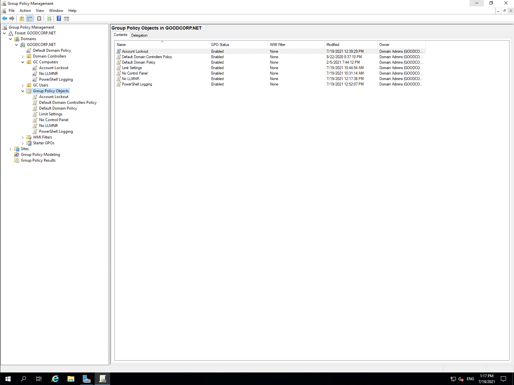
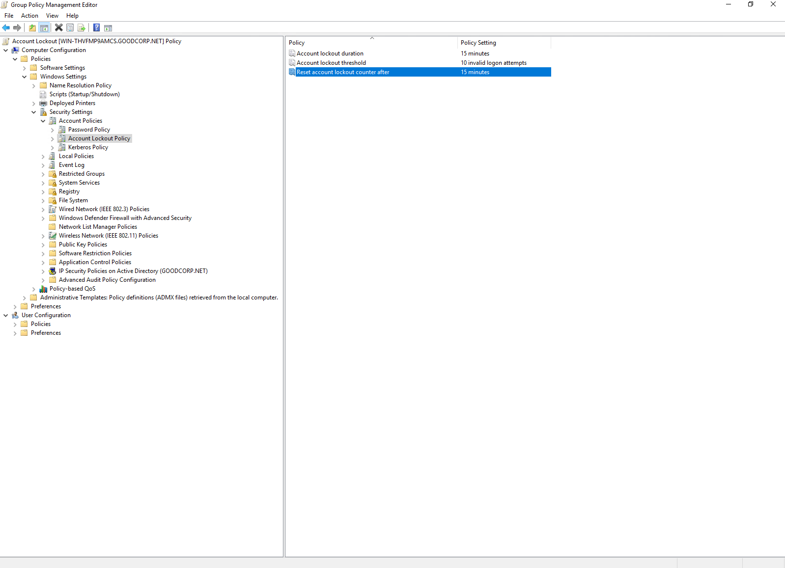
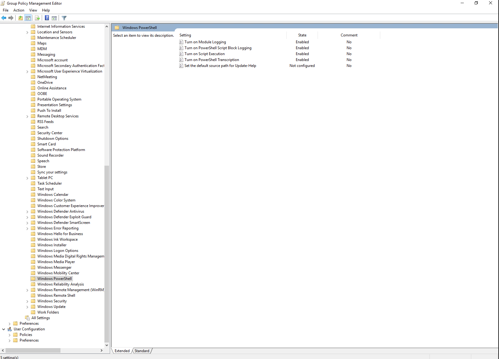
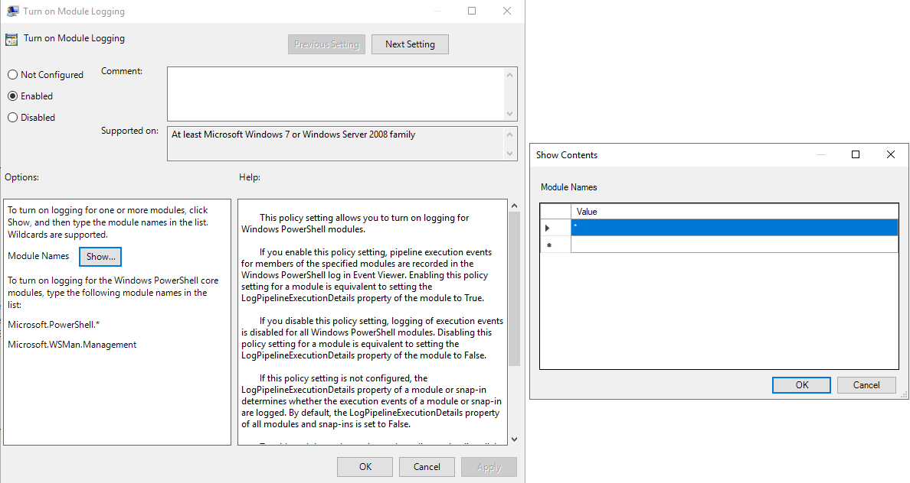
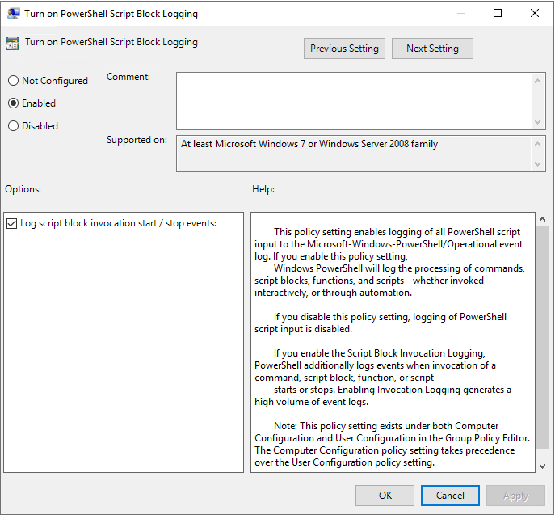
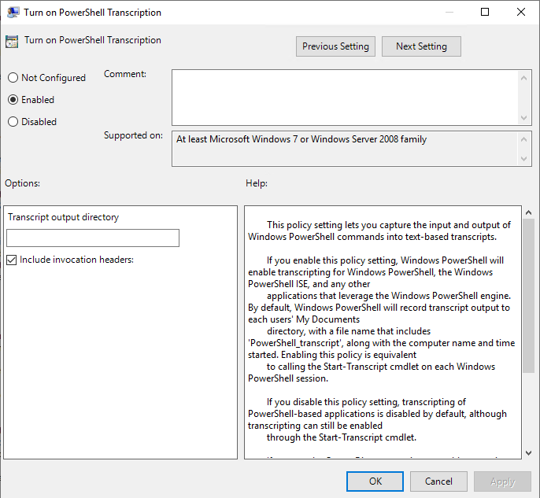
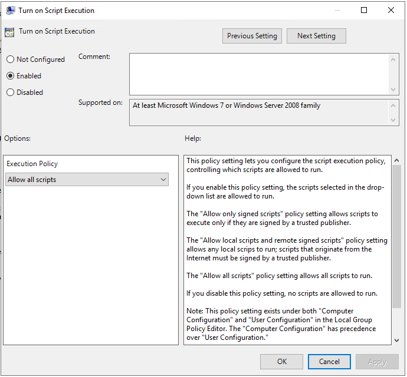

# Week 7: A Day in the Life of a Windows Sysadmin

Tasks completed:
1. Create a GPO: Disable Local Link Multicast Name Resolution (LLMNR)
    - 
2. Create a GPO: Account Lockout
    - 
3. Create a GPO: Enabling Verbose PowerShell Logging and Transcription
    - 
    - 
    - 
    - 
    - 
4. Create a Script: Enumerate Access Control Lists
    - [Script Created](./Task4/enum_acls.ps1)
5. Verify PowerShell Logging GPO
    - [Output File](./Task5/PowerShell_transcript.DESKTOP-SITPOTH.KVAxYIsi.20210719131442.txt)