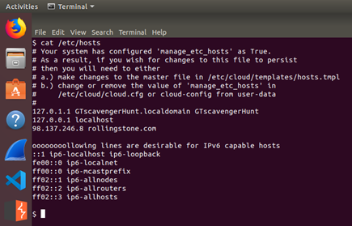

# Networking Fundamentals Homework: Rocking your Network
## Phase 1: "I'd like to Teach the World to Ping"
### Determining the IPs in the Hollywood Office accepting connections
- Command run:
    ```
    fping -g 15.199.95.91/28
    fping -g 15.199.94.91/28
    fping -g 11.199.158.91/28
    fping -g 167.172.144.11/32
    fping -g 11.199.141.91/28
    ```
    
-	or create bash script:
    ```
    #!/bin/bash
    iplist=(15.199.95.91/28 15.199.94.91/28 11.199.158.91/28 167.172.144.11/32 11.199.141.91/28)
    for IP in ${iplist[@]}
    do
        fping -g -a $IP
    done
    ```

    

-	IP address 167.172.144.11 accepting connections. All other IP addresses are not accepting connections.

#### Vulnerability
- 167.172.144.11 is responding to ping request, as RockStar Corp doesn’t want to respond to any requests, this is a vulnerability.

#### Mitigation Recommendation
- Restrict ICMP echo requests for IP 167.172.144.11 to prevent ping requests.
#### OSI Layer
- Layer 7 – Network
    - Ping uses IP addresses and IPs are on the Network Layer

---

## Phase 2: "Some Syn for Nothin`"
### Run SYN Scan against IP 167.172.144.11
- Command run:
    `sudo nmap -sS 167.172.144.11`
    
    

#### Result from SYN SCAN
- The port accepting connections is: 22

#### Vulnerability
- Port 22 is the default port for SSH connections. With this information, attackers will be able to deduce that SSH is enabled on this device.

#### Mitigation Recommendation
- Using a firewall or another network device to filter out SYN packets from unauthorised IP addresses or closing the port if SSH is not needed.

#### OSI Layer
- SYN scans run on Layer 4 – Transport
    - Syn scans use TCP\UDP ports, therefore occurs on Layer 4 

---

## Phase 3: "I Feel a DNS Change Comin' On"
### Determine if you can access the server that is accepting connections
-	Command run:
`ssh jimi@167.172.144.11 -p 22`

-	SSH to server successful with username and password to the server at 167.172.144.11:22 (hostname: GTscavengerHunt).
### Determine if something was modified on this system that might affect viewing rollingstone.com within the browser.
-	Command run:
`cat /etc/hosts`

-	Host file appears to have been modified to redirect rollingstone.com to 98.137.246.8
-	Entry in hosts file = `98.137.246.8 rollingtsone.com`
-	Running NS lookup command:
`nslookup 98.137.246.8`

#### Vulnerability
-	SSH successful via the Username: jimi and Password: hendrix.
-	Host file has been modified
#### Mitigation Recommendation
- Ensure no other users have sudo access to modifying the /etc/hosts file
#### OSI Layer
Layer 7 – Application
- The host file is used to map hostnames to IP addresses, like purpose of a DNS, which occurs on Layer 7.
 
---

## Phase 4: "ShARP Dressed Man"
### Locating the note from the hacker
`ls -la /etc/`


- Located packet capture information


- View file
`cat /etc/packetcaptureinfo.txt`


-	Downloaded the pcapng file from: 
`https://drive.google.com/file/d/1ic-CFFGrbruloYrWaw3PvT71elTkh3eF/view?usp=sharing`


### Analysed pcap file with wireshark
#### ARP Protocol
- Attacker used ARP spoofing to direct traffic to 192.168.47.200 intended for “the good host” at 00:0c:29:0f:71:a3 to the attackers physical address of 00:0c:29:1d:b3:b1.

 
#### HTTP Protocol
- The attacker appears to be an employee at RockStar Corp. who has sent a message to Gottheblues via the Contact Us for at: www.gottheblues.yolasite.com/contact-us.php, advising that they have left port 22 open and will provide the username and password for 1 “Milliion” Dollars.
> "Hi Got The Blues Corp!  This is a hacker that works at Rock Star Corp.  Rock Star has left port 22, SSH open if you want to hack in.  For 1 Milliion Dollars I will provide you the user and password!"


#### Mitigation Recommendation
- Set up static ARP entries – permanent IP-to-MAC mapping in local ARP cache

#### OSI Layer
-	ARP – Layer 2 – Data Link
-	HTTP – Layer 7 - Application
