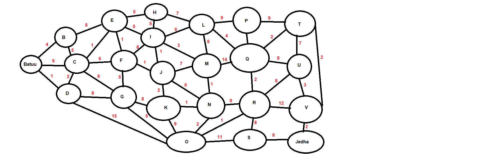
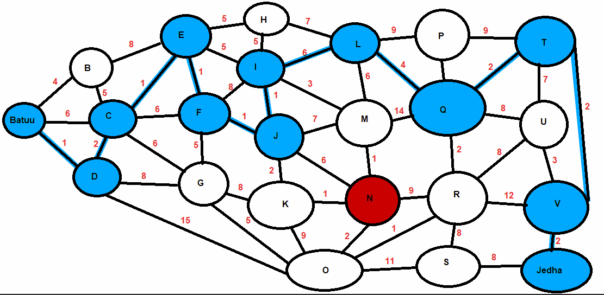
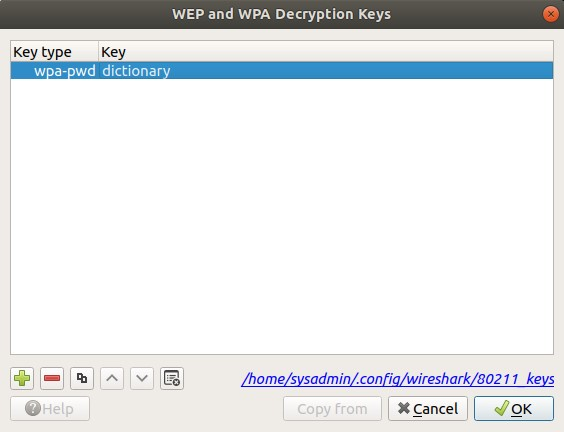
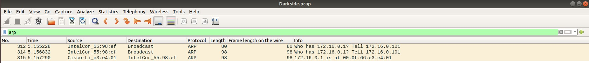
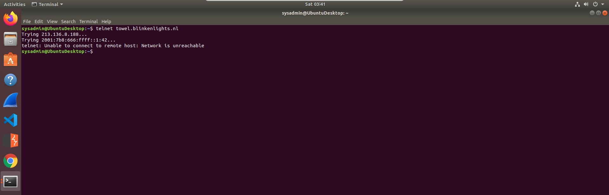
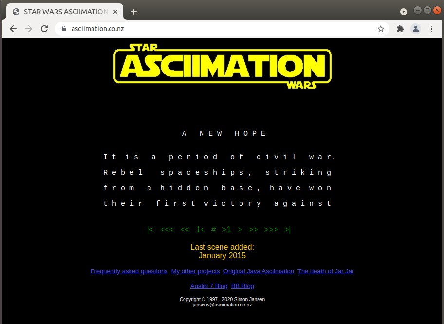

## Networks Fundamentals II Homework: *In a Network Far, Far Away!*
### Mission 1
1. Determine and document the mail servers for starwars.com using NSLOOKUP
    ```bash
    sysadmin@UbuntuDesktop:~$ nslookup -type=MX starwars.com
    Server:		8.8.8.8
    Address:	8.8.8.8#53

    Non-authoritative answer:
    starwars.com	mail exchanger = 10 aspmx2.googlemail.com.
    starwars.com	mail exchanger = 5 alt1.aspx.l.google.com.
    starwars.com	mail exchanger = 1 aspmx.l.google.com.
    starwars.com	mail exchanger = 5 alt2.aspmx.l.google.com.
    starwars.com	mail exchanger = 10 aspmx3.googlemail.com.

    Authoritative answers can be found from:

    ```
    
2. Explain why the Resistance isn't receiving any emails.
    - The resistance isn't receiving any emails because when the sender sends and email, the email is forwarded to the sender's email server.
    - This email server then does an MX lookup for The Resistance's mail server in the starwars.com MX record. 
    - As the mail exchangers in the MX record is incorrect, the sender's mail server is unable to send the email to The Resistance's mail server.

3. Document what a corrected DNS record should be.
    - The correct DNS record should be:
        ```
        starwars.com	mail exchanger = 1 asltx.l.google.com
        starwars.com	mail exchanger = 5 asltx.2.google.com
        ```

### Mission 2
1. Determine and document the `SPF` for `theforce.net` using NSLOOKUP
    ```bash
    sysadmin@UbuntuDesktop:~$ nslookup -type=TXT theforce.net
    Server:		8.8.8.8
    Address:	8.8.8.8#53

    Non-authoritative answer:
    theforce.net	text = "google-site-verification=XTU_We07Cux-6WCSOItl0c_WS29hzo92jPE341ckbOQ"
    theforce.net	text = "google-site-verification=ycgY7mtk2oUZMagcffhFL_Qaf8Lc9tMRkZZSuig0d6w"
    theforce.net	text = "v=spf1 a mx mx:smtp.secureserver.net include:aspmx.googlemail.com ip4:104.156.250.80 ip4:45.63.15.159 ip4:45.63.4.215"

    Authoritative answers can be found from:

    ```
    - v=spf1 a mx mx:smtp.secureserver.net include:aspmx.googlemail.com ip4:104.156.250.80 ip4:45.63.15.159 ip4:45.63.4.215

2. Explain why the Force's emails are going to spam.
    - The SPF record indicates which mail servers are allowed to send emails on it's behalf.
    - Because the Force's mail server had a change in IP address, the new IP address of `45.23.176.21` is not in the SPF record therefore failing the SPF check is sent to the users spam folder. 


3. Document what a corrected DNS record should be.
    - theforce.net	text = "v=spf1 a mx mx:smtp.secureserver.net include:aspmx.googlemail.com ip4:45.23.176.21"

### Mission 3
1. Document how a CNAME should look by viewing the CNAME of `www.theforce.net` using NSLOOKUP.

2. Explain why the sub page of `resistance.theforce.net` isn't redirecting to `theforce.net`.

3. Document what a corrected DNS record should be.

### Mission 4
1. Confirm the DNS records for `princessleia.site`.

2. Document how you would fix the DNS record to prevent this issue from happening again.

### Mission 5
1. View   and determine the `OSPF` shortest path from `Batuu` to `Jedha`.

2. Confirm your path doesn't include `Planet N` in its route.
    

3. Document this shortest path so it can be used by the Resistance to develop a static route to improve the traffic.

### Mission 6
1. Figure out the Dark Side's secret wireless key by using Aircrack-ng.

2. Use the Dark Side's key to decrypt the wireless traffic in Wireshark.
    
    

3. Once you have decrypted the traffic, figure out the following Dark Side information:
    1. Host IP Addresses and MAC Addresses by looking at the decrypted `ARP` traffic.
    

### Mission 7
1. View the DNS record from Mission #4.
2. The Resistance provided you with a hidden message in the `TXT` record, with several steps to follow.
3. Follow the steps from the `TXT` record.
4. Take a screen shot of the results.
    
    