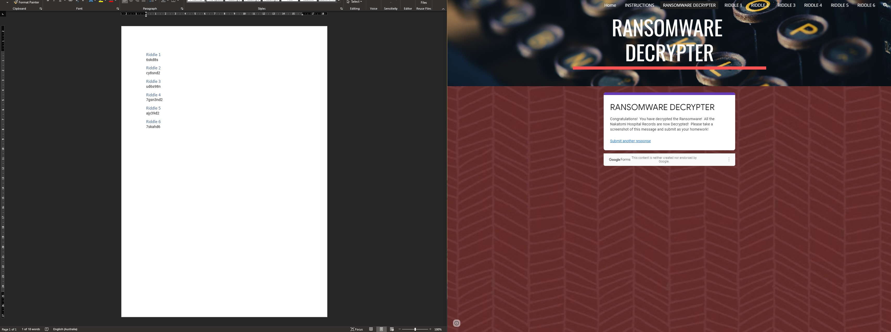

# Cryptography
- The main part of this homework assignment is focused around reinforcing the cryptography topics covered in class this week.

## Security+ Domains
- This unit covered portions of the following domains on the Security+ exam:
  - **1.0 Attacks, Threats, and Vulnerabilities**
  - **2.0 Architecture and Design**
  - **3.0 Implementation**

## Scenario
- You will play the role of a cybersecurity analyst at Nakatomi Hospital.
    - Unfortunately, one of the hospital's doctors opened up an email containing ransomware.
    - This ransomware spread throughout the hospital and encrypted all of the Patient Records.
    - The ransomware has given you two options to decrypt and retrieve the patient records: Either pay 100 bitcoins or solve six riddles.
    - Since you refuse to pay off any ransom, you'll have to solve six cryptographic riddles. Act fast: the doctors need to access the patient records as lives are at stake!

## Topics Covered in Your Assignments
- Encryption
- Decryption
- Caesar Cipher
- Encoding and Decoding
- Binary
- Symmetric and Asymmetric Encryption
- Open SSL
- Key/IV
- Public/Private Keys
- Key Distribution
- Hashing
- Hashing Algorithms
- Hashcat
- Steganography
- Steghide

