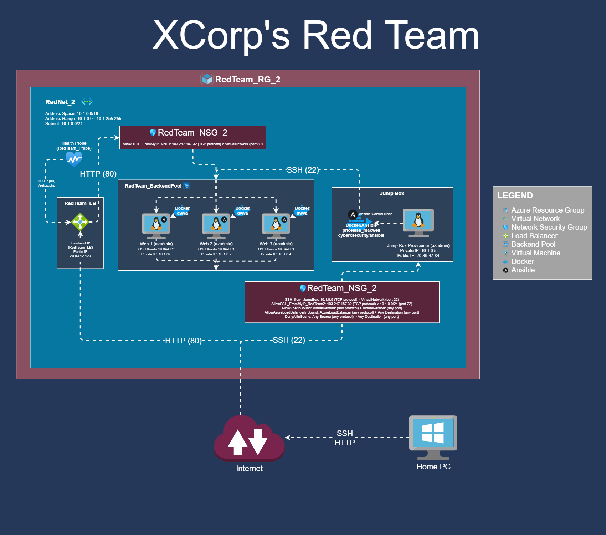

# Week 12: Cloud Security

## Security+ Domains
- This unit covered portions of the following domains on the Security+ exam:
    - **2.0 Architecture and Design and 3.0 Implementation**
        - Web server
        - Application server
        - Network infrastructure devices
        - Firewalls
        - Proxies / VPNs
        - Load Balancers
        - Network Segmentation/Isolation
        - Continuous integration
        - Immutable systems
        - Infrastructure as code
        - Cloud deployment models
        - Hypervisor
        - Continuos Monitoring
        - Redundancy
        - High availability

## Objectives:
- Created a virtual network.
- Protected the network with a firewall and completed several firewall rules.
- Deployed a jump box to the network.
- Deployed two identical VMs to the network.
- Used Docker containers to run a website and Ansible.
- Used Ansible to configure their VMs with code (infrastructure as code).
- Configured a load balancer to distribute traffic among the VMs.
- Verified redundancy by turning off one or more virtual machines used in the infrastructure

## Task:
- Create a network diagram that shows the entire cloud setup, including the Ansible jump box and the Docker containers running on each VM.
    