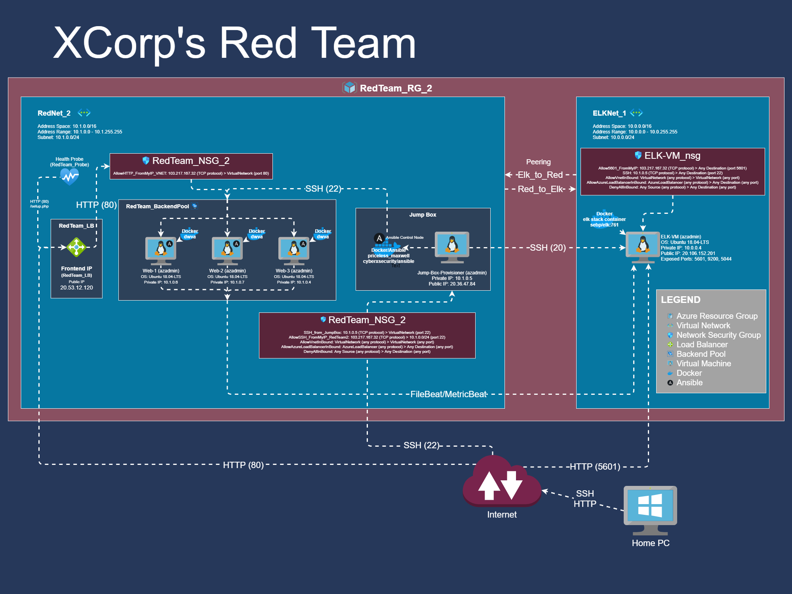

## Automated ELK Stack Deployment

The files in this repository were used to configure the network depicted below.



These files have been tested and used to generate a live ELK deployment on Azure. They can be used to either recreate the entire deployment pictured above. Alternatively, select portions of the YAML file may be used to install only certain pieces of it, such as Filebeat.

  - [Set up docker on webservers and download DVWA](playbooks/dvwa-playbook.yml)
  - [Set up docker on ELK VM](playbooks/elkdocker-playbook.yml)
  - [Set up and download ELK docker container](playbooks/install-elk.yml)
  - [Set up FileBeat](playbooks/filebeat-playbook.yml)
  - [Set up MetricBeat](playbooks/metricbeat-playbook.yml)

  Config Files used
  - [FileBeat Config File](playbooks/filebeat-config.yml)
  - [MetricBeat Config File](playbooks/metricbeat-config.yml)

This document contains the following details:
- Description of the Topology
- Access Policies
- ELK Configuration
  - Beats in Use
  - Machines Being Monitored
- How to Use the Ansible Build


### Description of the Topology

The main purpose of this network is to expose a load-balanced and monitored instance of DVWA, the D*mn Vulnerable Web Application.

Load balancing ensures that the application will be highly available, in addition to restricting access to the network.

Integrating an ELK server allows users to easily monitor the vulnerable VMs for changes to the log data and system metrics.

The configuration details of each machine may be found below.

| Name     | Function | IP Address | Operating System |
|----------|----------|------------|------------------|
| Jump-Box-Provisioner | Gateway with Docker running the Ansible Control Node | 10.1.0.5 | Linux (ubuntu 18.04) |
| Web-1    | Web Server with Docker running DVWA | 10.1.0.6 | Linux (ubuntu 18.04)  |
| Web-2    | Web Server with Docker running DVWA | 10.1.0.7 | Linux (ubuntu 18.04)  |
| Web-3    | Web Server with Docker running DVWA | 10.1.0.4 | Linux (ubuntu 18.04)  |
| ELK-VM   | Running Elastic Stack | 10.0.0.4 | Linux (ubuntu 18.04)  |

### Access Policies

The machines on the internal network are not exposed to the public Internet. 

Only the Jump-Box-Provisioner machine can accept connections from the Internet. Access to this machine is only allowed from the following IP addresses:
- 103.217.167.32

Machines within the network can only be accessed by Ansible docker container on the Jump-Box-Provisioner on the IP, 10.1.0.5.

A summary of the access policies in place can be found in the table below.

| Name     | Publicly Accessible | Allowed IP Addresses |
|----------|---------------------|----------------------|
| Jump-Box-Provisioner | Yes (via port 22)| 103.217.167.32       |
|  Web-1   |     No              |    10.1.0.5          |
|  Web-2   |     No              |    10.1.0.5          |
|  Web-3   |     No              |    10.1.0.5          |
| ELK-VM   |     Yes (via port 5601)  |    103.217.167.32        |
| RedTeam_LB |  Yes (via port 80) | 103.217.167.32        |

### Elk Configuration

Ansible was used to automate configuration of the ELK machine. No configuration was performed manually, which is advantageous because it ensured that the setup was consistent and reduces errors and variations between ELK machines.

The playbook implements the following tasks:
- Install `docker.io` using the `apt` module
- Install `python3-pip` via the `apt` module
- Install `docker` via the `pip` module
- Set `docker` to start on start of the VM via the `systemd` module
- Increase virtual memory of the VM and set to use more memory via `systemctl`
- Download and launch the `docker elk container` and publishing ports: 5601, 9200 and 5044

The following screenshot displays the result of running `docker ps` after successfully configuring the ELK instance.


### Target Machines & Beats
This ELK server is configured to monitor the following machines:
| Name     | IP Address |
|----------|------------|
| Web-1    | 10.1.0.6   | 
| Web-2    | 10.1.0.7   | 
| Web-3    | 10.1.0.4   | 

We have installed the following Beats on these machines:
| Name     | Beats Installed |
|----------|-----------------|
| Web-1    | FileBeat 7.4.0 and MetricBeat 7.6.1 | 
| Web-2    | FileBeat 7.4.0 and MetricBeat 7.6.1 | 
| Web-3    | FileBeat 7.4.0 and MetricBeat 7.6.1 | 

These Beats allow us to collect the following information from each machine:
- The `FileBeat` module collects log data and events whereas the `MetricBeat` module collects metrics and statistics, for example: CPU, memory and data related to services running on the server.

### Using the Playbook
In order to use the playbook, you will need to have an Ansible control node already configured. Assuming you have such a control node provisioned: 

SSH into the control node and follow the steps below:
- Copy the YAML (.yml) file to `/etc/ansible`.
- Update the `/etc/ansible/host` file to include:
  ```
  [webservers]
  10.1.0.6 ansible_python_interpreter=/usr/bin/python3
  10.1.0.7 ansible_python_interpreter=/usr/bin/python3
  10.1.0.4 ansible_python_interpreter=/usr/bin/python3

  [elk]
  10.0.0.4 ansible_python_interpreter=/usr/bin/python3
  ```
  - where the IP addresses are the IP addresses of your Web Servers and ELK server

- Run the playbook, and navigate to `http://20.36.47.84:5601/app/kibana` (where the IP address is the public IP address of your ElasticStack server) to check that the installation worked as expected.


<!---_As a **Bonus**, provide the specific commands the user will need to run to download the playbook, update the files, etc._--->