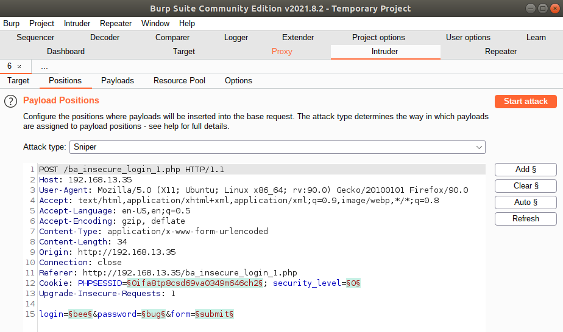

# Unit 15 Homework - Web Vulnerabilities and Hardening

---
## Web Application 1: *Your Wish is My Command Injection*
<details>
<summary> Click here to view progress screenshots. </summary>


</details>

### Deliverable
```bash
8.8.8.8 && cat ../../../../../etc/passwd
```


```bash
8.8.8.8 && cat ../../../../../etc/hosts
```


#### Mitigation Strategies
- Input Validation - by enforcing correct syntax in the fields (e.g. only allowing the format of IP addresses) and only passing the value if validation is successful.
- Input Sanitisation - by removing/replacing unwanted characters (e.g. removing '&' and 'cat' from the input)

---
## Web Application 2: *A Brute Force to Be Reckoned With*
<details>
<summary> Click here to view progress screenshots. </summary>





</details>

### Deliverable


#### Mitigation Strategies
- Account Lockout - by locking out an account after a number of failed log in attempts
- Implementing Captcha - by requiring an extra captcha to be passed before the login attempt
- Implementing multifactor authentication - by requiring an extra randomised input (e.g. yubikey, or code sent to email/SMS)

---
## Web Application 3: *Where's the BeEF?*
<details>
<summary> Click here to view progress screenshots. </summary>


</details>

### Deliverable


#### Mitigation Strategies
- Browser configuration - by implementing technical controls such as preventing browsers from running scripts and plugins by default
    - coupled with education such in workplace security awareness training to be aware of prompts to run scripts when browsing websites