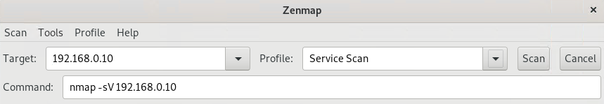

## Week 16 Homework Submission File: Penetration Testing 1
---
### Step 1: Google Dorking

- Using Google, can you identify who the Chief Executive Officer of Altoro Mutual is:
  - **Karl Fitzgerald**
- How can this information be helpful to an attacker:
  - From this information, attackers can find out more information via social engineering and OSINT.

---
### Step 2: DNS and Domain Discovery

Enter the IP address for `demo.testfire.net` into Domain Dossier and answer the following questions based on the results:

1. Where is the company located:
   - The company is located at **Sunnyvale CA 94085 in the United States**
  
2. What is the NetRange IP address:
   - **65.61.137.64 - 65.61.137.127**
  
3. What is the company they use to store their infrastructure:
   - **Rackspace Backbone Engineering** at 9725 Datapoint Drive, Suite 100 , San Antonio TX 78229
  
4. What is the IP address of the DNS server:
   - The IP address of the DNS server is **65.61.137.117**

---
### Step 3: Shodan

- What open ports and running services did Shodan find:
  | **Port** | Service           |
  |----------|-------------------|
  | **80**   | Apache-Coyote/1.1 |
  | **443**  | Apache-Coyote/1.1 |
  | **8080** | Apache-Coyote/1.1 |

---
### Step 4: Recon-ng

- Install the Recon module `xssed`. 
  ```
  [recon-ng][default] > marketplace install xssed
  ```
- Set the source to `demo.testfire.net`. 
  ```
  [recon-ng][default] > modules load recon/domains-vulnerabilities/xssed
  [recon-ng][default][xssed] > options set SOURCE demo.testfire.net
  ```
- Run the module. 
  ```
  [recon-ng][default][xssed] > run
  ```

Is Altoro Mutual vulnerable to XSS: 
  ```
  -----------------
  DEMO.TESTFIRE.NET
  ----------------- 
  [*] Category: XSS 
  [*] Example: http://demo.testfire.net/search.aspx?txtSearch=%22%3E%3Cscript%3Ealert(%2Fwww.sec-...
  [*] Host: demo.testfire.net 
  [*] Notes: None 
  [*] Publish_Date: 2011-12-16 00:00:00
  [*] Reference: http://xssed.com/mirror/57864/ 
  [*] Status: unfixed 
  [*] -------------------------------------------------

  -------
  SUMMARY 
  -------
  1 total (1 new) vulnerabilities found. 
  ```
  - Yes, Altoro Mutual is vulnerable to XSS

---
### Step 5: Zenmap

Your client has asked that you help identify any vulnerabilities with their file-sharing server. Using the Metasploitable machine to act as your client's server, complete the following:

- Command for Zenmap to run a service scan against the Metasploitable machine: 

  
    ```
    nmap -T4 -A -v -oN zenmapscan.txt 192.168.0.10
    ``` 
  - Bonus command to output results into a new text file named `zenmapscan.txt`: ``-oN zenmapscan.txt``
  
    
- Zenmap vulnerability script command:
  
  
- Once you have identified this vulnerability, answer the following questions for your client:
1. What is the vulnerability:
    - Samba 3.0.20
    - Anonymous users are able to read/write to `\\192.168.0.10\tmp` (`C:\tmp`)

2. Why is it dangerous:
    - Attackers would be able to write malicious files/codes to the folder to be executed

3. What mitigation strategies can you recommendations for the client to protect their server:
    - Prevent read/write to directories by anonymous users
    - Updated to the latest version of SMB
    - Utilise a firewall to prevent access from unauthorised IP addresses
    - Block ports 139 and 445 from access via public IP addresses
    - Use a jumpbox to restricted access


---
© 2020 Trilogy Education Services, a 2U, Inc. brand. All Rights Reserved.  

