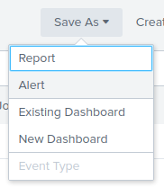
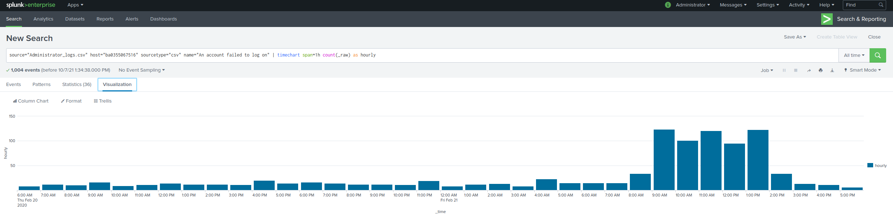

# Unit 18 Homework: Lets go Splunking!

### Your Objective 

Utilize your Splunk skills to design a powerful monitoring solution to protect Vandaly from security attacks.

## Vandalay Industries Monitoring Activity Instructions

### Step 1: The Need for Speed 

**Background**: As the worldwide leader of importing and exporting, Vandalay Industries has been the target of many adversaries attempting to disrupt their online business. Recently, Vandalay has been experiencing DDOS attacks against their web servers.

Not only were web servers taken offline by a DDOS attack, but upload and download speed were also significantly impacted after the outage. Your networking team provided results of a network speed run around the time of the latest DDOS attack.

**Task:** Create a report to determine the impact that the DDOS attack had on download and upload speed. Additionally, create an additional field to calculate the ratio of the upload speed to the download speed.

1.  Upload the following file of the system speeds around the time of the attack.
    - 
    - 

2. Using the `eval` command, create a field called `ratio` that shows the ratio between the upload and download speeds.
   - 
      
3. Create a report using the Splunk's `table` command to display the following fields in a statistics report:
    - `_time`
    - `IP_ADDRESS`
    - `DOWNLOAD_MEGABITS`
    - `UPLOAD_MEGABITS`
    - `ratio`
  
   - 

4. Answer the following questions:

    - Based on the report created, what is the approximate date and time of the attack?
      - Based on the report create, the attack occurred at *approximately* **4:30:00PM** on the **23rd of February 2020**.
    - How long did it take your systems to recover?
      - It look approximately **9 hours** for the system to recover.
         - start 2020-02-23 14:30:00
         - end 2020-02-23 23:30:00

---
### Step 2: Are We Vulnerable? 

**Background:**  Due to the frequency of attacks, your manager needs to be sure that sensitive customer data on their servers is not vulnerable. Since Vandalay uses Nessus vulnerability scanners, you have pulled the last 24 hours of scans to see if there are any critical vulnerabilities.

  - For more information on Nessus, read the following link: https://www.tenable.com/products/nessus

**Task:** Create a report determining how many critical vulnerabilities exist on the customer data server. Then, build an alert to notify your team if a critical vulnerability reappears on this server.

1. Upload the following file from the Nessus vulnerability scan.
    - 

2. Create a report that shows the `count` of critical vulnerabilities from the customer database server.
   - The database server IP is `10.11.36.23`.
   - The field that identifies the level of vulnerabilities is `severity`.
      - 
      - 

      - Only `critical` required
         - 
      
3. Build an alert that monitors every day to see if this server has any critical vulnerabilities. If a vulnerability exists, have an alert emailed to `soc@vandalay.com`.
   - 
   - 
   - 
---
### Step 3: Drawing the (base)line

**Background:**  A Vandaly server is also experiencing brute force attacks into their administrator account. Management would like you to set up monitoring to notify the SOC team if a brute force attack occurs again.

**Task:** Analyze administrator logs that document a brute force attack. Then, create a baseline of the ordinary amount of administrator bad logins and determine a threshold to indicate if a brute force attack is occurring.

1. Upload the administrator login logs.
   - 

2. When did the brute force attack occur?
   - Hints:
      - Look for the `name` field to find failed logins.
         - 
         - 
      - Note the attack lasted several hours.
         - 
         - Attack began between 8am and 9am
         - Lasting over 5 hours and ending between 2-3pm
      
3. Determine a baseline of normal activity and a threshold that would alert if a brute force attack is occurring.
   - 
      - Hourly Average = 27.89
      - Standard Deviation = 35.39
         - Baseline ~ Hourly Average + 2x(Standard Deviation)
         - Baseline ~ 27.89 + 2x35.39
         - Baseline ~ 98.67
            - Although calculated baseline is 98 (rounding down), the event at 95 may have been missed as it is below the threshold of 98
               - 
            - A baseline of 30 may be more appropriate as it'll allow the SOC team to react to the attack earlier (i.e. at 8am on the 21st of February 2020), as opposed to being alerted after the attack has already occurred. Threshold should be reviewed in the future to prevent alert fatigue.

4. Design an alert to check the threshold every hour and email the SOC team at SOC@vandalay.com if triggered. 
   - 
   - 

---

© 2020 Trilogy Education Services, a 2U, Inc. brand. All Rights Reserved.
