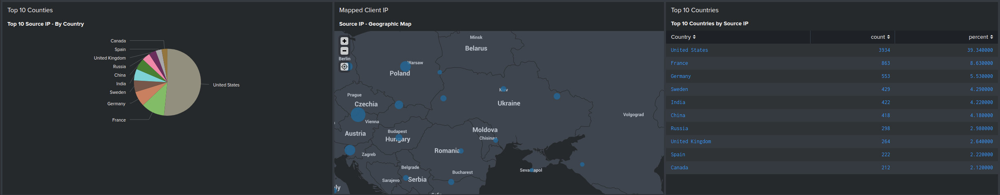

## Unit 19 Homework: Protecting VSI from Future Attacks

---

### Part 1: Windows Server Attack

Note: This is a public-facing windows server that VSI employees access.

#### Question 1
- Several users were impacted during the attack on March 25th.
- Based on the attack signatures, what mitigations would you recommend to protect each user account? Provide global mitigations that the whole company can use and individual mitigations that are specific to each user.

    - Global Mitigation
        - implementing MFA, such as Yubikey, in order to login with "Something you have"
        - implementing Single Sign-On (SSO), therefore reducing the need to use password to log in
        - allow login only via VPN access from an approved device
        - password reset One-Time Password (OTP) sending to mobile phone number as opposed to emails which can be accessed from multiple devices

    - Individual Mitigations
        - using devices that are provided by the company and not logging in from personal devices
        - not logging into email on multiple clients - reducing the chance an attacker intercepting the password reset request
  
#### Question 2
- VSI has insider information that JobeCorp attempted to target users by sending "Bad Logins" to lock out every user.
- What sort of mitigation could you use to protect against this?

    - blacklisting known JobeCorp IP addresses 
    - blocking source IP addresses where an attempt is made on a second account after locking out the first account
    - on the first failed attempt at login - prompt with a CAPTCHA to prevent scripted attacks
    - whitelisting IP addresses of employees of VSI
  

### Part 2: Apache Webserver Attack:

#### Question 1
- Based on the geographic map, recommend a firewall rule that the networking team should implement.
    - Block all incoming HTTP traffic where the source IP comes from Ukraine
- Provide a screen shot of the geographic map that justifies why you created this rule.
    - Before the attack, there was no traffic coming from Ukraine in the Top 10:
      
    - During the attack, there was a significant increase in traffic from Ukraine:
      
  
#### Question 2

- VSI has insider information that JobeCorp will launch the same webserver attack but use a different IP each time in order to avoid being stopped by the rule you just created.
- What other rules can you create to protect VSI from attacks against your webserver?
    - Assuming that the rule above in question 1 is set
        - Block User Agent: Mozilla/4.0 - restricting use of outdated browsers
        - Block User Agent: Chef Client/10.18.2 - attackers appear to have automated the process
            - There is a small number of users using Mozilla/4.0 prior to the attack - these users may require an updated browser once this is implemented
            - Before Attack
              
            - During Attack
              

---

© 2020 Trilogy Education Services, a 2U, Inc. brand. All Rights Reserved.
