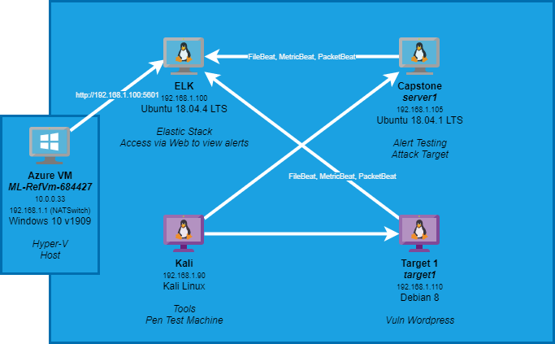
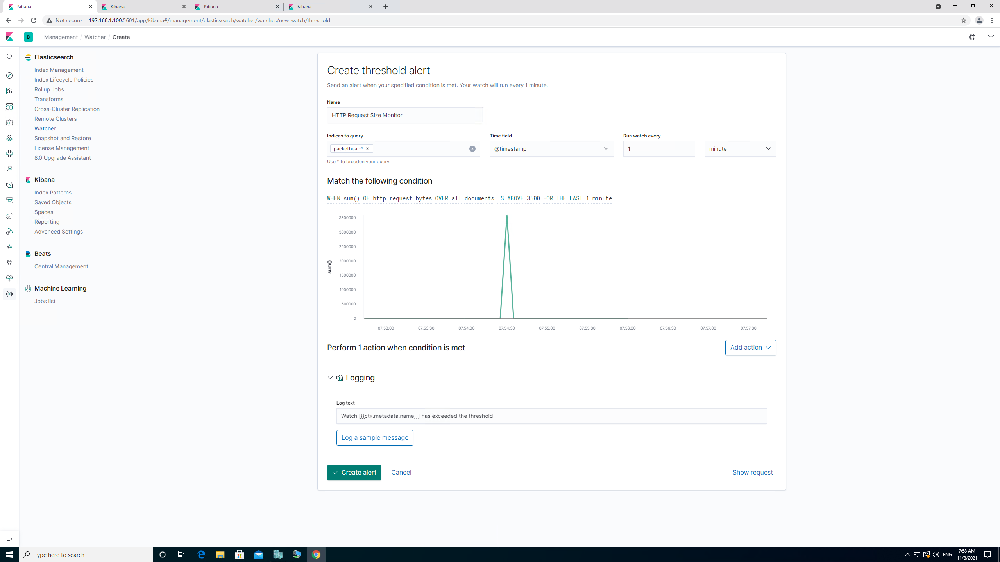
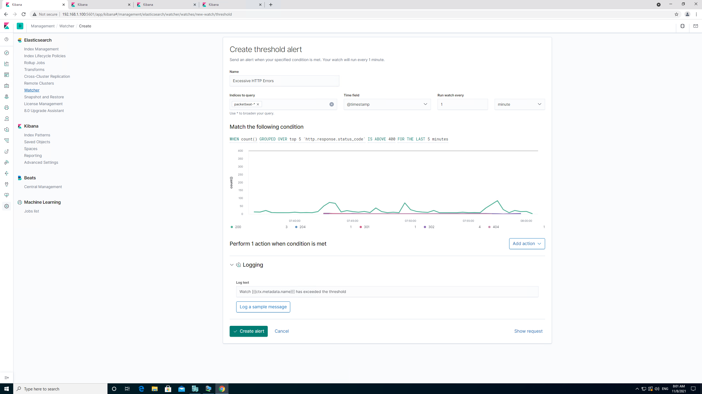
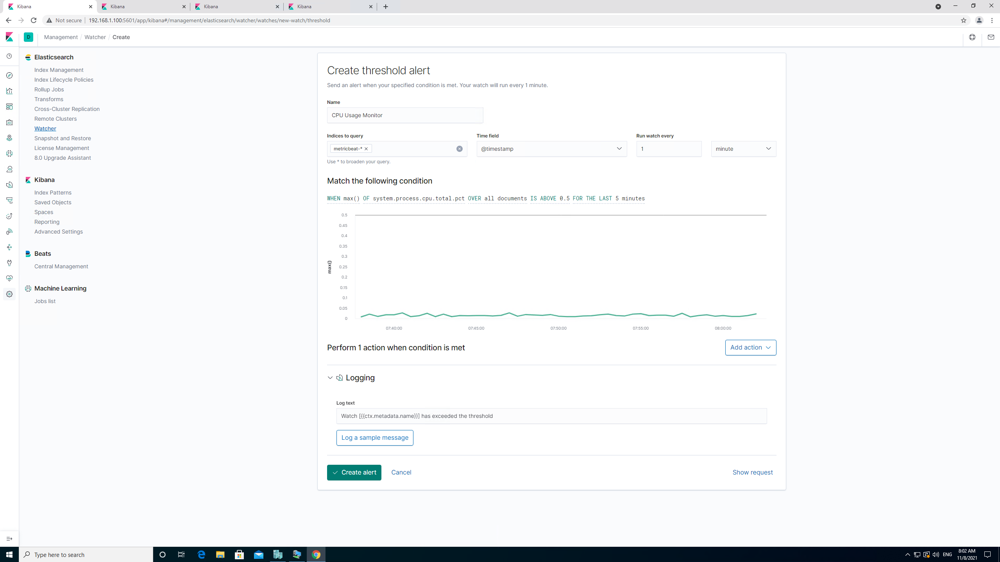

# Blue Team: Summary of Operations

## Table of Contents
- [Network Topology](#network-topology)
- [Description of Targets](#description-of-targets)
- [Monitoring the Targets](#monitoring-of-targets)
- [Suggestions for Going Further](#suggestion-for-going-further)


### Network Topology


The following machines were identified on the network:
- ELK
  - **Operating System**: Ubuntu 18.04.4 LTS
  - **Purpose**: ELK Server
  - **IP Address**: 192.168.1.100
- server1 [Capstone]
  - **Operating System**: Ubuntu 18.04.1 LTS
  - **Purpose**: Testing Kibana Alerts
  - **IP Address**: 192.168.1.105
- target1
  - **Operating System**: Debian 8 (jessie)
  - **Purpose**: Target machine for attack
  - **IP Address**: 192.168.1.110
- Kali
  - **Operating System**: Kali Linux Rolling
  - **Purpose**: Attacking VM
  - **IP Address**: 192.168.1.90
- ML-RefVm-684427
  - **Operating System**: Windows 10 v1909 (Build 18363.900)
  - **Purpose**: Azure VM - HyperV host
  - **IP Address**: 10.0.0.33, 192.168.1.1 (NATSwitch)


### Description of Targets
The target of this attack was: `Target 1` 192.168.1.110

Target 1 is an Apache web server and has SSH enabled, so ports 80 and 22 are possible ports of entry for attackers. As such, the following alerts have been implemented:

### Monitoring the Targets

Traffic to these services should be carefully monitored. To this end, we have implemented the alerts below:

#### HTTP Request Size Monitor
HTTP Request Size Monitor is implemented as follows:
  - **Metric**: http.request.bytes
  - **Threshold**: 3500
  - **Vulnerability Mitigated**: Website scanning with wpscan
  - **Reliability**: The threshold for this alert was set low and have generated a number of false positives
  <br>
  

#### Excessive HTTP Errors
Excessive HTTP Errors is implemented as follows:
  - **Metric**: http.response.status_code
  - **Threshold**: 400
  - **Vulnerability Mitigated**: Brute force of directories on web and application servers
  - **Reliability**: The alert was set at a reasonable threshold and is reliable to pick up brute force attacks on the server by detecting error 404
  <br>
  

#### CPU Usage Monitor
CPU Usage Monitor is implemented as follows:
  - **Metric**: system.process.cpu.total.pct
  - **Threshold**: 0.5
  - **Vulnerability Mitigated**: Configuration of resource management 
  - **Reliability**: As there were many false positives from the configuration, this setup is not reliable
  <br>
  

### Suggestions for Going Further
- Each alert above pertains to a specific vulnerability/exploit. Recall that alerts only detect malicious behavior, but do not stop it.

The logs and alerts generated during the assessment suggest that this network is susceptible to several active threats, identified by the alerts above. In addition to watching for occurrences of such threats, the network should be hardened against them. The Blue Team suggests that IT implement the fixes below to protect the network:
- Enumeration of users with WPScan
  - **Set up Varnish for the Wordpress server**
    - in sub vcl_recv
      ```
      #stop wpscan user enumeration
      if (req.url ~ "\?author\=([0-9]*)") {
          error 403 "Not allowed";
      }

      #to stop wpscan advanced enumeration

      if (req.url == "/" && req.request == "POST" && !req.http.cookie ~ "wordpress_logged_in") {
          error 403 "Not allowed";
      }
      ```
  - **Why It Works**: It prevents WPScan from accessing the requested author URLs and also prevents enumeration via the POST method

- Brute force of directories on web and application servers
  - **Implementing a Web Application Firewall (WAF)**
    - Signature detection
    - IP whitelisting
    - Protected pages
    - Bot blocking
  - **Why It Works**: 
    - The signature detection will block against known attacks
    - IP white listing allows only access by the website administrators - this could block access from IPs other than those originating from known sources
    - Protected pages with the use of multifactor authentication can prevent bots accessing pages with sensitive information
    - Bot blocking will automatically block known malicious bots and hacker tools from attacking the site

- Resource management 
  - **Set up load balancer with multiple servers in the server pool**
  - **Why It Works**: 
    - Ensuring that not one server is overloaded and affecting the availability of the content of the server
    - By implementing a load balancer, this will ensure that the load is spread across multiple servers
